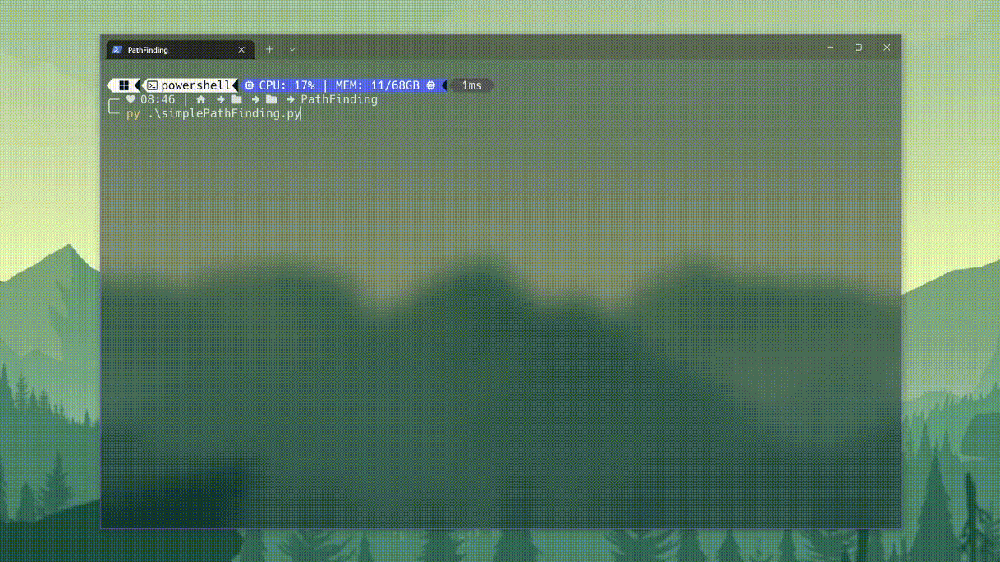

# simple-PathFinding
A very simple pathfinding algorithm that I made just for fun

> ## How does it works?
>it's preatty simple, if the end is to the right of the current position, then it goes to the right, if it is to the bottom it goes to the bottom, and so on
>
> ## And what about the obstacles?
> the obstacles have not yet been implemented, but soon ( maybe ) there will be
